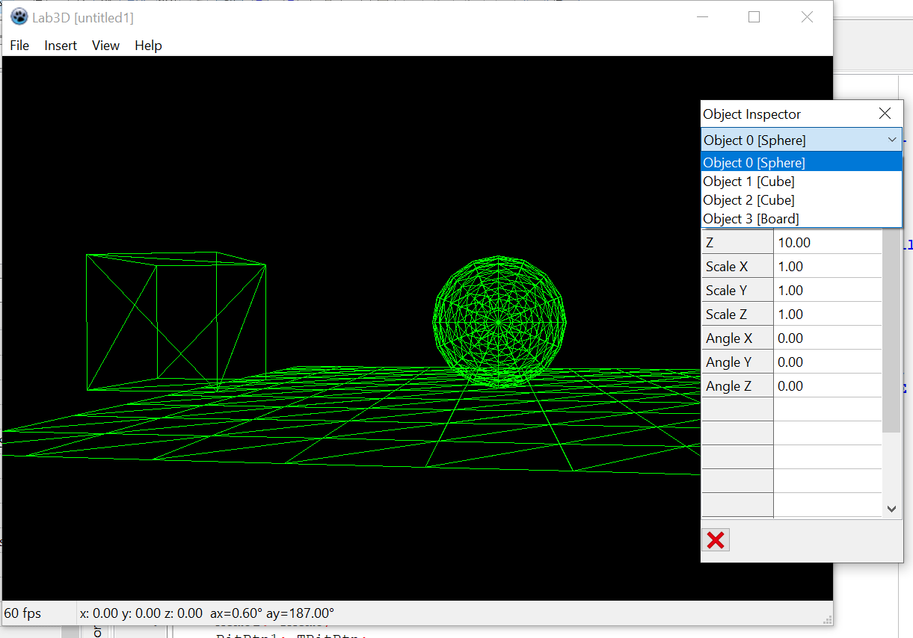

Lab3D
=====

This is a 3D modelling software that I originally wrote in Delphi 4
during a high school project around 2002-2003. I am currently porting it
to Lazarus.

This software does all the rendering on its own. It does not use any
OpenGL features other than setting up a framebuffer. The following
features are currently available:

- Creating wireframe scenes
- Cubes, spheres, surfaces
- Saving/loading project files
- Editing scene properties
- Moving around the scene with the keyboard and the mouse

More features from the old Delphi version will be ported in the future.

Delphi 4 version
----------------

*Written in French for historical reasons, it was a project
at a french high school.*

Ceci est un logiciel de modélisation 3D que j'ai réalisé dans le cadre
des travaux personnels encadrés (TPE) au lycée international de
Ferney Voltaire en terminale S (2002-2003), avec mes camarades de classe
Céline Cailliez et Gaelle Ledet.

Le logiciel s'occupe de lui-même du rendu 3D, il n'utilise pas
OpenGL, DirectX, ou autre à part pour écrire les pixels sur une
surface 2D. Il y a une simulation primitive de la gravité et de la
collision des objets, ce qui rend possible de faire tomber des balles
sur des surfaces.

Ce dépôt inclut :
- Le code source en Delphi 4
- La documentation
- La présentation du projet
- La version binaire du logiciel

Le code source est fourni en l'état et ne compilera probablement
pas vu son âge avancé. Si j'ai le temps, je le mettrais à jour pour le
faire tourner avec des technologies plus modernes.

La version binaire est incluse et fonctionne encore assez bien sur
Windows 10.

